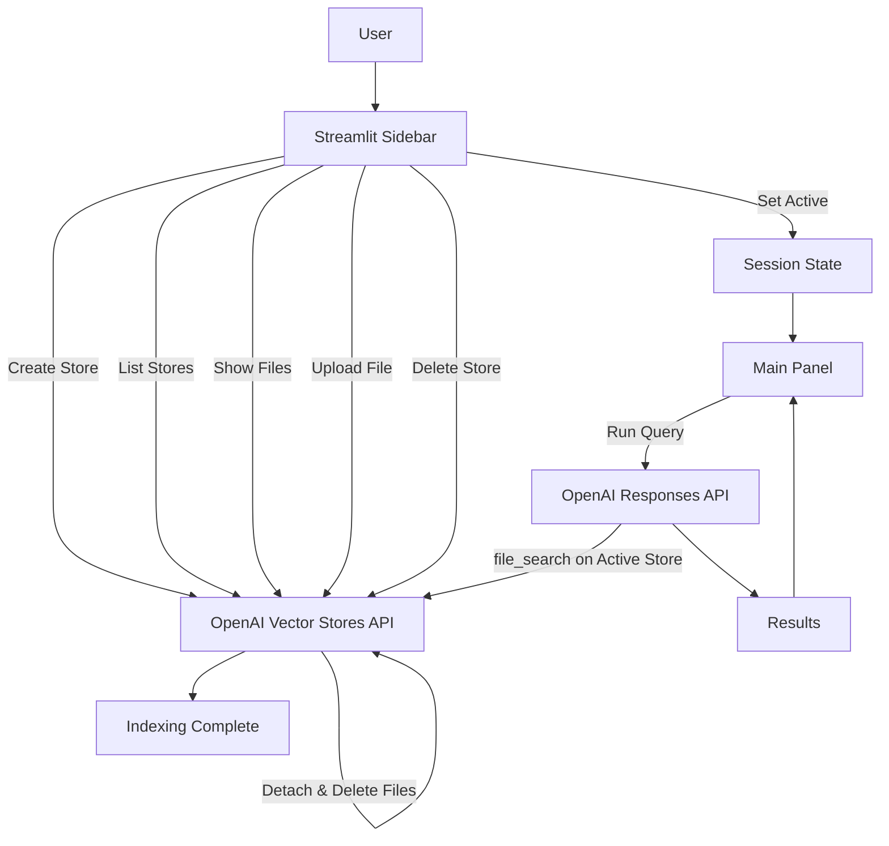
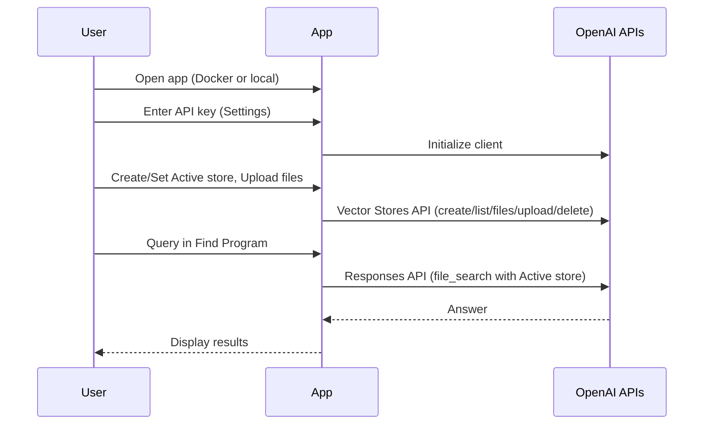

# Bug Bounty Program Finder

A minimal Streamlit app that lets you:
- Manage OpenAI Vector Stores (create, set active, list files, upload files, delete stores/files)
- Search for bug bounty programs using the OpenAI Responses API with the `file_search` tool on your active store


## Quick start (Docker)

Prerequisites:
- Docker
- Docker Compose

Build and run:

```sh
docker compose up --build -d
```

Open the app:

```text
http://localhost:8501/
```

Stop:

```sh
docker compose down
```

## Quick start (local)

```sh
uv venv .venv
uv pip install -r requirements.txt
uv run streamlit run app.py --server.port 8501
```

## How it works

1) Settings (sidebar)
- Enter your OpenAI API key (required) and preferred model.
- The key is kept in `st.session_state` and used to initialize the OpenAI client.

2) Knowledge Base (sidebar)
- Create vector stores, set one as Active.
- Toggle “Show files” per store to list files in that store.
- Upload files to the Active store; the app waits until indexing is complete.
- Delete stores; associated files are detached and deleted first.

3) Find Program (main panel)
- Enter a query and run; the app calls the Responses API with `file_search` against the Active store.
- Results are displayed in the main panel.

## Workflows (diagrams)





## Notes
- No `.env` required; all operations rely on the API key you input in the sidebar.
- Deleted stores also delete their files to avoid orphans.
- Requirements are minimized to `streamlit` and `openai`.

## Sample data (optional)
- You can place files from the [bounty-targets-data](https://github.com/arkadiyt/bounty-targets-data) repository into a local `data/` folder to try the app with real bug bounty program scopes (e.g., `domains.txt`, `wildcards.txt`, `bugcrowd_data.json`, `hackerone_data.json`, `intigriti_data.json`, `yeswehack_data.json`).
- Use the sidebar’s Upload control to add these files to your Active store; the app will wait until indexing completes before they’re available for search.